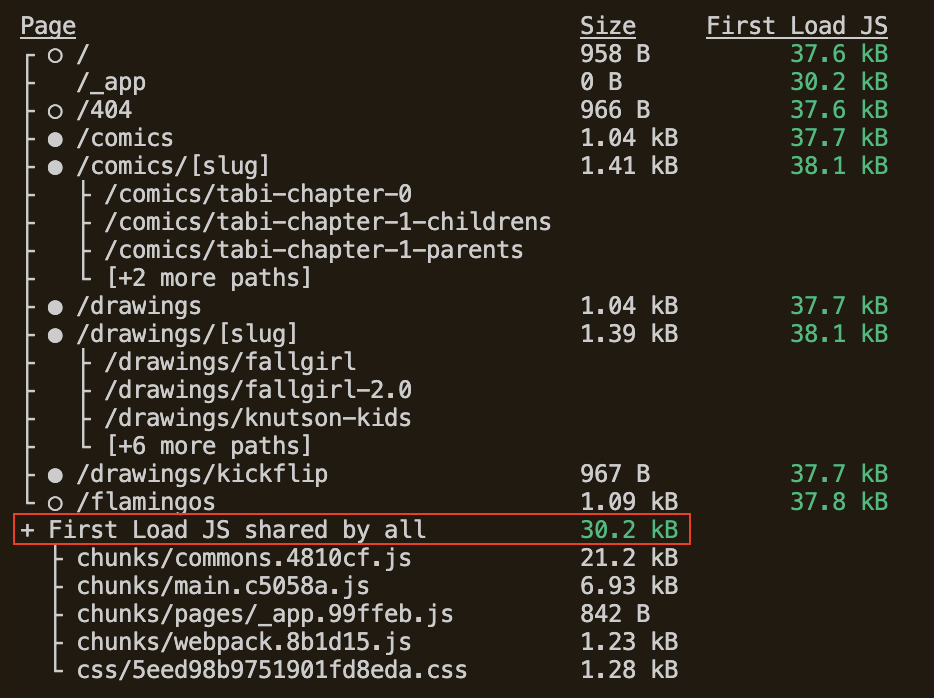
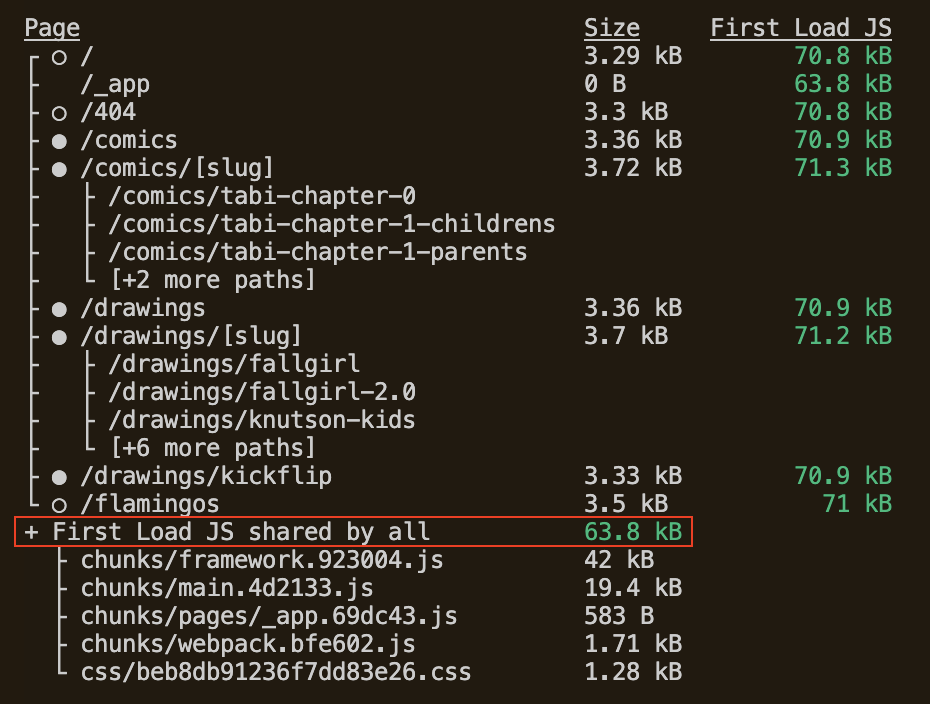
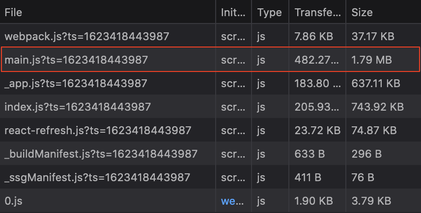
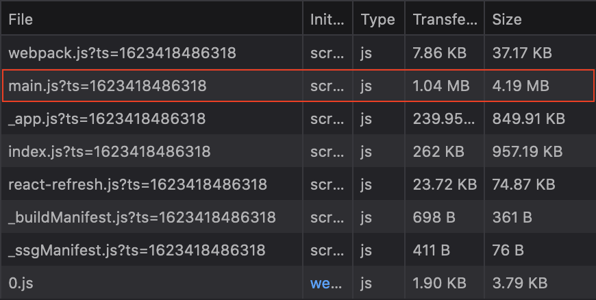

kitajchuk-web
=============

> Once a day unlearn something new.

## Stack

- [Next.js](https://nextjs.org)
- [Preact](https://preactjs.com/)

## Jamstack

- [kitajchuk.vercel.app](https://kitajchuk.vercel.app/)
  - Build command: `yarn download-s3 && next build`
- [kitajchuk.netlify.app](https://kitajchuk.netlify.app/)
  - Build command: `yarn download-s3 && next build && next export`
  - Publish directory: `out`
- Required env vars for the project:
  - `KITA_S3_REPOSITORY`
  - `KITA_AWS_ACCESS_KEY_ID`
  - `KITA_AWS_SECRET_ACCESS_KEY`
  - `KITA_AWS_REGION`

## Commands

- `yarn install`
  - Installs node packages
  - Installs [husky](https://typicode.github.io/husky/) for git `pre-commit` hooks
  - Husky will run `yarn build` before a git commit and stop the commit if `lint` or `build` fails
- `yarn dev`
  - Serves local dev at [localhost:3000](http://localhost:3000)
- `yarn lint`
  - Runs [ESLint](https://eslint.org/) validations on source JS
  - Install the [ESLint plugin for Visual Studio Code](https://marketplace.visualstudio.com/items?itemName=dbaeumer.vscode-eslint&ssr=false#overview)
- `yarn build && yarn start`
  - Create an optimized Next.js production build and serve it locally
- `yarn build && yarn export`
  - Create a static production build for any static deploy target

## Preact vs React

Preact production build:

React production build:

Preact development in browser:

React development in browser:

